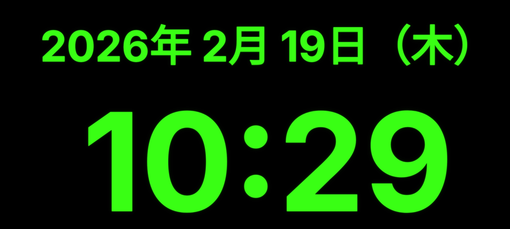

# Neon Clock

ネオングリーンのグロウエフェクトで日本時間（JST）を表示する、シンプルで美しい Android 時計アプリ。

---

## スクリーンショット



---

## 特徴

- **画面幅いっぱいの時刻表示** — どの画面サイズでも HH:mm が最大サイズで表示される
- **日付表示** — `yyyy年 M月 d日（曜日）` を時刻と同じ幅で表示
- **ネオングロウエフェクト** — 3層の Shadow によるリアルなネオン発光
- **全画面イマーシブモード** — ステータスバー・ナビゲーションバーを完全非表示
- **画面回転対応** — 縦・横・逆向きすべてに追従
- **常時点灯** — スリープしない（壁掛け時計として使用可能）
- **日本標準時（JST）固定** — タイムゾーン設定に依存しない

---

## 動作確認端末

| 端末 | OS | 状態 |
|---|---|---|
| OPPO Reno7A | Android 11〜13 | ✅ 動作確認済み |

---

## 技術スタック

| カテゴリ | 技術 |
|---|---|
| 言語 | Kotlin 2.0.21 |
| UI フレームワーク | Jetpack Compose (BOM 2024.12.01) |
| フォント | Inter Bold |
| ビルドツール | Gradle 8.7.3 (AGP 8.7.3) |
| 最小 SDK | Android 8.0 (API 26) |
| ターゲット SDK | Android 15 (API 35) |

---

## アーキテクチャ

```
MainActivity
└── NeonClockScreen          # 時計画面のルート Composable
    ├── BoxWithConstraints    # 画面サイズ取得
    ├── rememberTextMeasurer  # テキスト幅の正確な計測
    ├── 二分探索              # 最適フォントサイズの動的計算
    └── NeonText              # ネオングロウエフェクト付きテキスト
        ├── Layer1: 外側グロウ（blurRadius=18, alpha=0.20）
        ├── Layer2: 中間グロウ（blurRadius=6,  alpha=0.45）
        └── Layer3: メインテキスト（blurRadius=2,  alpha=0.95）
```

---

## セットアップ

### 必要なもの

- Android Studio Ladybug 以降
- JDK 17 以降
- Android SDK (API 26〜35)

### ビルド手順

```bash
# リポジトリをクローン
git clone https://github.com/peco-glhf/time.git
cd time

# Android Studio で開くか、コマンドラインでビルド
./gradlew assembleDebug

# 端末に直接インストール（USBデバッグが有効な端末が接続されている場合）
./gradlew installDebug
```

---

## プロジェクト構成

```
app/
├── src/main/
│   ├── java/com/example/neonclock/
│   │   └── MainActivity.kt          # UI 全体（唯一のソースファイル）
│   ├── res/
│   │   ├── drawable/
│   │   │   ├── ic_launcher_foreground.xml   # アプリアイコン（時計デザイン）
│   │   │   └── ic_launcher_background.xml   # アイコン背景（黒）
│   │   ├── font/
│   │   │   └── inter_bold.ttf               # Inter Bold フォント
│   │   ├── mipmap-anydpi-v26/
│   │   │   └── ic_launcher.xml              # アダプティブアイコン定義
│   │   └── values/
│   │       ├── strings.xml                  # アプリ名
│   │       └── themes.xml                   # テーマ（全画面・黒背景）
│   └── AndroidManifest.xml
└── build.gradle.kts
```

---

## 色定義

| 定数 | カラーコード | 用途 |
|---|---|---|
| `NeonGreen` | `#39FF14` | メインテキスト・アイコン |
| `NeonGreenMid` | `#20CC00` | 中間グロウ |
| `NeonGreenDim` | `#0D5500` | 外側グロウ |

---

## コントリビューション

Issue・Pull Request を歓迎します。

1. このリポジトリを Fork する
2. フィーチャーブランチを作成する（`git checkout -b feature/xxx`）
3. 変更をコミットする（`git commit -m 'feat: xxx'`）
4. ブランチを Push する（`git push origin feature/xxx`）
5. Pull Request を作成する

---

## ライセンス

MIT License — 詳細は [LICENSE](LICENSE) を参照してください。
